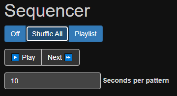
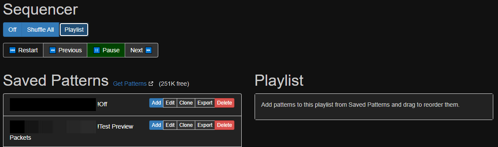
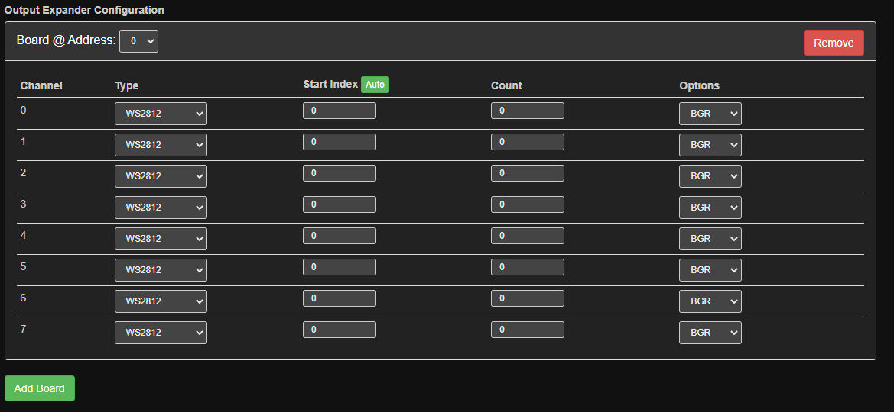
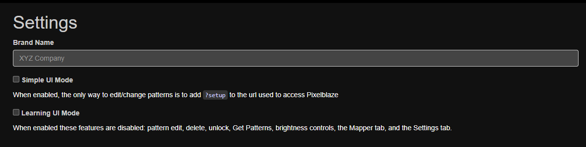

# The Pixelblaze protocol
***being an unofficial and apocryphal exegesis of the websocket and HTTP traffic between a Pixelblaze and its webUI***

# Disclaimer

This document was produced for informational purposes only; it is neither sanctioned nor recommended by @wizard.  Used incorrectly, some of these commands could cause data loss, brick/shorten the lifespan of a Pixelblaze, or cause excessive power consumption which may damage any connected LEDs or in extreme cases create a fire hazard. 

*However*...the insights described below were gained from observation of the conversation  taking place between a correctly-configured Pixelblaze and its user interface webpage, and within that context the risk of repeating commands already known to be valid is minimal.

There is no guarantee that this information has been, is, or will remain correct for your particular configuration.  Any use is solely at the user's own risk.

# General observations

### Notes

- The Pixelblaze runs both a webserver (listening on :80) and a websocket server (listening on port 81).  When a client webbrowser connects to the Pixelblaze webUI on port 80, the webserver  returns the file `index.html.gz` which contains the webUI application. The webbrowser unpacks and executes the webUI application (written in javascript), and _most_ of the subsequent interactions take place over the websocket (the exceptions are structured as REST-ish commands to `GET`, `POST` or `DELETE` information using HTTP).

- In general, the websocket protocol is client-server with the webUI making a request and, in most cases, the Pixelblaze sending a response. HOWEVER, the Pixelblaze also sends four packets out-of-band which can interrupt the request/response flow:
  * After each render cycle, a preview frame representing the pixels of the currently executing pattern are sent as a binary packet of type 05 (_previewFrame_) whose format is described below;
  * Whenever the current pattern is changed by the sequencer, the Pixelblaze sends the new  state of the sequencer: `{"activeProgram":{"activeProgramId":patternId,"controls":{}},"sequencerMode":sequencerMode,"runSequencer":true,"playlist":{"position":0,"id":"\_defaultplaylist\_","ms":sequencerTime,"remainingMs":countdown}}`; 
  * Once every second, the Pixelblaze sends a message with diagnostics and statistics: `{"fps":41.95804,"vmerr":0,"vmerrpc":-1,"mem":2111,"exp":0,"renderType":2,"uptime":48156306,"storageUsed":795419,"storageSize":2949250}`; and
  * The response to the `{"getConfig":true}` request consists of three separate messages (detailed below) that can come out of sequence.

- Most websocket messages are JSON strings, but a few messages are sent as binary packets containing a *messageType* byte, a *continuationFlags* byte, and *dataBlock*s of varying lengths.

  - *messageTypes* are:
    - 01 = _putSourceCode_ (from webUI to Pixeblaze)
    - 03 = _putByteCode_ (from webUI to Pixelblaze)
    - 04 = _previewImage_ (from webUI to Pixelblaze)
    - 05 = _previewFrame_ (from Pixelblaze to webUI) – **this message type does not have continuation flags**
    - 06 = _getSourceCode_ (from Pixelblaze to webUI)
    - 07 = _getProgramList_ (from webUI to Pixelblaze)
    - 08 = _putPixelMap_ (from webUI to Pixelblaze)
    - 09 = _expanderConfig_ (from webUI to Pixelblaze AND from Pixelblaze to webUI)

  - *continuationFlags* are bitwise OR'ed together (a message that fits in a single websocket frame will have _continuationFlags* `frameFirst | frameLast`, otherwise the message is assembled by concatenating packets until `frameLast` is seen):
    - 01 = _frameFirst_
    - 02 = _frameMiddle_
    - 04 = _frameLast_

- Upon loading, the webUI requests the current configuration of the Pixelblaze with: `{"sendUpdates":false,"getConfig":true,"listPrograms":true,"getUpgradeState":true}`.
  
  - The response to `getConfig` is three packets containing:

    - the _settingsConfig_: 
    
      `{"name":name,"brandName":brandName,"pixelCount":pixelCount,"brightness":uiBrightness,"maxBrightness":maxBrightness,"colorOrder":"GRB","dataSpeed":3500000,"ledType":2,"sequenceTimer":15,"sequencerMode":0,"runSequencer":false,"simpleUiMode":false,"learningUiMode":false,"discoveryEnable":true,"timezone":tzString,"autoOffEnable":false,"autoOffStart":"00:00","autoOffEnd":"00:00","cpuSpeed":240,"networkPowerSave":false,"mapperFit":1,"exp":0,"ver":"3.24"}`;

    - the _sequencerConfig_: 
    
      `{"activeProgram":{"name":"Editor","activeProgramId":null,"controls":{}},"sequencerMode":0,"runSequencer":false}`; and

    - the _ExpanderConfig:
    
       (a binary message with messageType _expanderConfig (09)_, whose contents are described below).
  
  - The response to `listPrograms` is detailed under the Patterns tab.
  
  - The response to `getUpgradeState` is `{"upgradeState":{"code":upgradeState}}`, where upgradeState can be:
    - 0 (_unknown_), 
    - 1 (_checking_), 
    - 2 (_inProgress_), 
    - 3 (_updateError_), 
    - 4 (_upToDate_), 
    - 5 (_updateAvailable_), or 
    - 6 (_updateComplete_). 
    
    If the _upgradeState_ is 5 (_updateAvailable_), clicking the "Update" button sends `{"upgradeVersion":"update"}` and then polls with `getUpgradeState` until the returned _upgradeState_ is 2, 3, or 4.

- Two sections are present at the top of the screen on all tabs:
  - The "Brightness" slider, when changed, sends `{"brightness":0..100}`.
  - UI controls (if any) for the active pattern, when changed, send the new values as:
`{"setVar":{varName:varValue}}`.

# Patterns tab


### Notes

- The Patterns tab (which is the default page when the webUI is loaded) requests the pattern list with: `{"getProgramList":true}`; the response is one or more binary packets of type 07 (_getProgramList_). For each pattern in the list, the webUI then requests its preview image with `{"getPreviewImg":patternId}`; the response is a JPG embedded in one or more packets of type 04 (_previewImage_).

- Clicking on a pattern name sends: `{"setActivePattern":patternId}`. After about 30 seconds, the webUI resends the command with a further parameter to save the pattern selection to flash: `{"setActivePattern":patternId, "save":true}`.

- Sequencer mode can be:
  - "Off": (shown above) where the "Off" button sends `{"sequencerMode":0}` with no response.

  - "Shuffle All":

    

    - "Shuffle All" button sends `{"sequencerMode":1}` which also starts the sequencer.
    - Changing the "seconds per pattern" field sends `{"sequenceTimer":30}`
    - "Pause" button sends `{"runSequencer":false}`.
    - "Play" button sends `{"runSequencer":true}`.
    - "Next" button sends `{"nextProgram":true}` which also starts the sequencer.
    - The response to all shuffle commands is the current state of the sequencer (the same message that arrives out-of-band).

  - "Playlist":
 
    - "Playlist" button sends `{"sequencerMode":2}` which also starts the sequencer.
    - "Pause", "Play" and "Next" buttons work the same as above.
    - "Restart" button sends `{"playlist":{"position":0}}`.
    - "Previous" button sends `{"playlist":{"position":currentNumber - 1}}` where currentNumber came from the most recently announced state of the sequencer.
    - "Add" button on pattern sends `{"playlist":{"id":"\_defaultplaylist\_","items":[{"id":patternId,"ms":durationInMs=30000}]},"save":true}`.
    - Adding a pattern, changing the duration, changing the order, or deleting a playlist pattern resends the whole list: `{"playlist":{"id":"\_defaultplaylist\_","items":[{"id":patternId1,"ms":durationInMs=30000}, {"id":patternId2,"ms":durationInMs=30000}, …]},"save":true}`.
    - The response to all playlist commands is the current state of the sequencer (the same message that arrives out-of-band).

# Edit tab


### Notes

- Any changes within the code pane cause the pattern code to be compiled, and if successful, the bytecode is sent to the Pixelblaze with messageType 03 (_putBytecode_) and it begins executing immediately.
- The pattern preview window at the top (which appears on all tabs) is updated every time the Pixelblaze sends a new binary packet of type 05 (_previewFrame_), which can arrive at any time.
- "Save" button sends three binary messages of type 04 (_PreviewImage_), 01 (_putSourceCode_), and 03 (_putByteCode_); if successful, the response is `{"ack":1,"saveProgramSourceFile":true}`.
- Brightness slider sends `{"brightness":0..100}`.
- "Vars Watch" button sends `{"getVars":true|false}`.

# Mapper tab


### Notes

- When the tab is loaded, the webUI fetches the _mapFunction_ from the Pixelblaze with a HTTP `GET` to the `/pixelmap.txt` endpoint.
- Any changes to the _mapFunction_ in the code pane are immediately compiled into _mapData_ and, if successful, cause a binary message of type 08 (_putPixelMap_) to be sent to the Pixelblaze where it is immediately available to the render engine.
- The "save" button sends `{"saveMap":true}` which tells the Pixelblaze to save the most-recently-uploaded _mapData_ to flash as `/pixelmap.dat`; it also saves the _mapFunction_ to flash as `/pixelmap.txt` by doing a a HTTP `POST` to the `/edit` endpoint with headers `Content-Type: application/x-www-form-urlencoded; charset=UTF-8` and the text of the mapper function as the body.

# Settings tab (v2)


### Notes

- Setting the LED type to "Output Expander" reveals another panel:

  

  Whenever any field is changed (including the "Add Board" and "Remove" buttons), the webUI recompiles the table into a binary _expanderData_ blob (details of which are below) and resends it to the Pixelblaze as a binary message of type 08 (_ExpanderSettings_).

# Settings tab (v3)


### Notes

- Essentially the same as v2, with the addition of the "Cpu Speed" field (which sends `{"cpuSpeed":"80|160|240"}`) and the "disableWifi" field (which sends `{"networkPowerSave":true|false}`).

# Wifi tab (v3 only)


Notes:

- Page load does a HTTP `GET` to the `/wifistatus` endpoint to populate the status field.

- "Scan" button does a HTTP `GET` to the `/wifiscan` endpoint to populate the access point list.

- "Submit" button does a HTTP `POST` to the `/wifisave` endpoint to save the Wifi configuration.

- These endpoints are described in further detail below.

# Advanced Settings tab 



### Notes

- The "Advanced Settings" tab is only visible when the webUI is loaded with the "/?setup" URL.

- The "Brand Name" field sends `{"brandName":newName}`.

- The "Simple UI" checkbox sends `{"simpleUiMode":true|false}`.

- The "Learning UI mode" checkbox sends `{"learningUiMode":true|false}`.

# Binary formats

## previewFrame message

Taking into account the packet framing described above (of which the `previewFrame` is unique in that it does not have a `continuationFlags` byte), the body of the `previewFrame` message consists of groupings of three bytes (corresponding to the _Red_, _Green_ and _Blue_ values) for each of the `pixelCount` pixels configured; for example the previewFrame for a 64-pixel setup would contain 1 (header) + 3 (RGB) * 64 (pixels) = 193 bytes.

| 0 | 1 | 2 | 3 | 4 | 5 | ... |
|--|--|--|--|--|--|--|
| [&nbsp;red_pixel0, | green_pixel0, | blue_pixel0&nbsp;] | [&nbsp;red_pixel1, | green_pixel1, | blue_pixel2&nbsp;] | ... |

## mapData message 

Taking into account the packet framing described above, the body of the `mapData` message consists of a header containing three 32-bit longwords in little-endian format, representing the _formatVersion_ (1 or 2), the number of dimensions a/k/a _numDimensions_ (1, 2 or 3), and the _dataSize_ in bytes (which is calculated as `formatVersion * numDimensions * numElements`).  The remainder of the message body contains _numElements_ tuples of _numDimensions_ values, which are either 8-bit (_formatVersion_=1) or 16-bit integers in little-endian format (_formatVersion_=2), representing the location of each particular pixel on that particular axis (X, Y or Z).  Each of these integers then needs to be divided by the respective `maxInt` for the _formatVersion_ (255 for _formatVersion_=1, 65535 for _formatVersion_=2) to obtain a floating-point world coordinate between 0 and 1.

For example, a 3-dimensional map with _formatVersion_=1 and 40 pixels would look like:

| 0 | 1 | 2 | 3 | 4 | 5 | 6 | 7 | 8 | 9 | 10 | 11 | 12 | 13 | 14 | 15 | 16 | 17 | ... |
|--|--|--|--|--|--|--|--|--|--|--|--|--|--|--|--|--|--|--|
| [&nbsp;1 | 0 | 0 | 0&nbsp;] | [&nbsp;3 | 0 | 0 | 0&nbsp;] | [&nbsp;40 | 0 | 0 | 0&nbsp;] | [&nbsp;X_0, | Y_0, | Z_0&nbsp;] | [&nbsp;X_1, | Y_1, | Z_1&nbsp;] | ... |

And a 2-dimensional map with _formatVersion_=2 and 24 pixels would look like:

| 0 | 1 | 2 | 3 | 4 | 5 | 6 | 7 | 8 | 9 | 10 | 11 | 12 | 13 | 14 | 15 | ... |
|--|--|--|--|--|--|--|--|--|--|--|--|--|--|--|--|--|
| [&nbsp;2 | 0 | 0 | 0&nbsp;] | [&nbsp;2 | 0 | 0 | 0&nbsp;] | [&nbsp;24 | 0 | 0 | 0&nbsp;] | [&nbsp;lsbX_0 | msbX_0, | lsbY_0 | msbY_0&nbsp;] | ... |

## expanderConfig message

Taking into account the packet framing described above, the body of the `expanderConfig` message consists of a _versionNumber_ byte of 05, followed by one or more 96-byte tables corresponding to each output expander (8 channels * 12 bytes/channel).

For example, defining two expanders like this:


produces a table like this, which (according to the data structures found in the [outputExpander source code](https://github.com/simap/pixelblaze_output_expander/blob/master/firmware/Core/Src/app.c)) can be decoded as follows:


Where:

* `addx|chan` is a packed byte (`addx:5|chan:3`) combining the expander address and the channel index;

* `ledType` is an enumeration with: 
  - 0=_‘notUsed’_, 
  - 1=_‘WS2812B’_, 
  - 2=_‘drawAll’_, 
  - 3=_‘APA102 Data’_, 
  - 4=_‘APA102 Clock’_;

* `numColors` is either 3 (for R/G/B) or 4 (for R/G/B/W);

* `colorOrder` is a packed byte (`R:2|G:2|B:2|W:2`) containing four 2-bit numbers indicating the order in which the colors appear (0=first, 3=last). The possible permutations are: 
  - `0x24`=_‘RGB’_, 
  - `0x18`=_‘RBG’_, 
  - `0x09`=_‘BRG’_, 
  - `0x06`=_‘BGR’_, 
  - `0x21`=_‘GRB’_, 
  - `0x12`=_‘GBR’_, 
  - `0xE4`=_‘RGBW’_, and 
  - `0xE1`=_‘GRBW’_;

* `pixelCount` is the number of pixels on this channel;

* `startIndex` is the first address in the range to be directed to this channel; and

* the four bytes marked as _‘notUsed’_ represent the `clockSpeed` for the channel, which is not currently supported in either the UI or the outputExpander driver but may be used in a future version.

## Easy Pattern Export (EPE) files

EPE files are a portable way of moving patterns between Pixelblazes, even if they have different versions and architectures.  EPE files can be exported from the Pixelblaze to the local computer from the "Patterns" tab, and imported from the local computer to another Pixelblaze on the "Edit" tab (from which it needs to be saved onto the new Pixelblaze).  

*Note: The Pixelblaze pattern language has evolved over time; patterns cannot be successfully imported onto a Pixelblaze whose firmware version does not support the language constructs (eg. array initializers, coordinate translations) they use.*

The file contents consist of a JSON dictionary containing:

* the user-assigned `name` of the pattern;

* an immutable `id` for the pattern generated on the Pixelblaze where it was first saved;

* a JSON dictionary of `sources` for the pattern, of which there is only one, named `main`, which contains the javascript-like source code of the pattern; and

* a base64-encoded JPEG `preview` image of the pattern, where each vertical row represents the state of the pixels for a single render cycle.

  When opened in a text editor, an EPE looks something like this:

  ````
  {
    "name": "Default New Pattern",
    "id": "keSLmg6tCWGPMvb85",
    "sources": { "main": "export function render(index) {\n  hsv(time(.1) + index/pixelCount, 1, 1)\n}"
  },
    "preview": "/9j/4AAQSkZJRgABAQAAAQABAAD/2wBDAAMCAgMCAgMDAwMEAwMEBQgFBQQEBQo...AAAAB//2Q=="
  }
  ````

EPE files *do not* contain the current values of the UI controls, which would have been nice.  Those can be exported and imported from the Pixelblaze filesystem separately using the REST-ish HTTP API.

## Pixelblaze Binary Pattern (PBP) files

Pixelblaze saves patterns to the flash filesystem as a binary blob with the filename `/{patternId}`. These blobs can be exported and imported from the Pixelblaze filesystem using the REST-ish HTTP API, which is the mechanism used by the **Firestorm** `clone` command and the Pixelblaze `backup`/`restore` buttons.

A PBP blob begins with a header consisting of nine 32-bit longwords representing:

* The format `versionNumber`;

* the `offset` to and `length` of the pattern's _Name_;

* the `offset` to and `length` of the pattern's _previewImage_;

* the `offset` to and `length` of the pattern's _byteCode_; and

* the `offset` to and `length` of the pattern's _sourceCode_.

These components occupy the remainder of the blob.

## Pixelblaze Binary Backup (PBB) files

Pixelblaze can also, from firmware versions 2.29/3.24 onwards, import and export the entire contents of the flash filesystem -- patterns, playlists and configuration, but not the webUI file itself -- to a local computer as a Pixelblaze Binary Backup.  This can be useful for archiving the state of a Pixelblaze, restoring its contents after an experiment gone wrong, or even provisioning multiple Pixelblazes with identical setups (though it would be a good idea afterwards to give them all different names).

The file contents consist of a JSON dictionary containing a single element, `files`, which is another JSON dictionary containing a _key/value_ tuple (where the _key_ is the filename and the _value_ is the file contents, encoded in base64) for each file stored in this Pixelblaze Binary Backup.

For example, a Pixelblaze Binary Backup for a Pixelblaze containing 11 patterns might look like this:

```
{
  "files": {
    "/apple-touch-icon.png": "iVBORw0KGgoAAAANSUhEUgAAALQAAAC0CAMAAAAKE/YAAAADAFBMVEUA...",
    "/config.json": "eyJuYW1lIjoiUGl4ZWxibGF6ZV84eDhtYXRyaXgiLCJicmFuZE5hbWUiOiIiLCJwa...",
    "/favicon.ico": "AAABAAMAMDAAAAEAIACoJQAANgAAACAgAAABACAAqBAAAN4lAAAQEAAAAQAgAGgEA...",
    "/l/_defaultplaylist_": "eyJpdGVtcyI6W119",
    "/p/4ANH2jwPKj8nasXeD": "AgAAACQAAAASAAAANgAAAK8DAADlAwAARwkAACwNAABuCwAAMUQgQXVyb...",
    "/p/4ANH2jwPKj8nasXeD.c": "eyJzbGlkZXJTcGVlZCI6MC44NTg0LCJzbGlkZXJXaWR0aCI6MC43NzU...",
    "/p/4u26f8x7GRsBjQeBn": "AgAAACQAAAAMAAAAMAAAAJUTAADFEwAAKAIAAO0VAAA6BAAAZ2xpdGNoI...",
    "/p/5aWMwDm9ALfJniBXi": "AgAAACQAAAATAAAANwAAALEMAADoDAAAIAEAAAgOAADQAAAAMUQgbWFyY...",
    "/p/7eeGvKegHGmCD5QAd": "AgAAACQAAAAIAAAALAAAAGAJAACMCQAAnQEAACkLAACYBwAAcHVsc2UgM...",
    "/p/7rkpwJrEQBffHPsye": "AgAAACQAAAAQAAAANAAAAIAPAAC0DwAALAEAAOAQAAC8AgAAY29sb3IgZ...",
    "/p/8EX6T2cpfA8WxLEEF": "AgAAACQAAAAMAAAAMAAAAEoPAAB6DwAADAEAAIYQAADMAQAAcmFpbmJvd...",
    "/p/HuAhJN9zTJKZEinMH": "AgAAACQAAAAEAAAAKAAAAK8DAADXAwAAXwAAADYEAABmAQAAIU9mZv/Y/...",
    "/p/gvM2bmyhQFm6bXd93": "AgAAACQAAAAVAAAAOQAAABkIAABSCAAAxgYAABgPAAB0BwAAQW5pbWF0Z...",
    "/p/gvM2bmyhQFm6bXd93.c": "eyJzbGlkZXJOdW1MaW5lcyI6MC4wNTg0LCJzbGlkZXJMaW5lV2lkdGg...",
    "/p/mvkAmMHcyPsNbPxyt": "AgAAACQAAAAUAAAAOAAAAAcUAAA/FAAAKAEAAGcVAADkAwAAY29sb3Igd...",
    "/p/vSFkZsKmhKSGpmf6E": "AgAAACQAAAAKAAAALgAAAK0KAADbCgAA6AAAAMMLAACyAAAAZmFzdCBwd...",
    "/p/zemcitFWMB3y3f9o2": "AgAAACQAAAAJAAAALQAAAHEVAACeFQAANAEAANIWAADaAQAAbWlsbGlwZ..."
  }
}
```

# HTTP endpoints

### Notes

* The normal way of accessing the Pixelblaze webUI is by using a webbrowser to `GET` the root endpoint, eg. `http://{pixelblazeIpAddress}/`.

  * Adding a queryString of `?min` to the above URL will reduce websocket traffic by stopping the webUI from requesting `previewFrame` images for the pattern list and by stopping the Pixelblaze from sending `previewFrame` messages for the currently executing pattern.  However, because  pattern files contain a `previewImage` it is necessary in this mode to re-enable `previewFrame` messages (by clicking on the pattern preview row at the top of the webUI) before attempting to edit and save a pattern.

  * Adding a queryString of `?setup` to the above URL will show an additional 'Advanced Settings' tab in the webUI which allows setting the `brandName` which appears in the top left corner of the webUI or enabling `simpleUI` and `learningUI` modes.

* WiFi configuration at initial setup is performed using the following endpoints:

  - `GET` to the `/wifistatus` endpoint returns the current WiFi configuration; the response is `{"status":wifiStatus,"ip":"x.x.x.x","ssid":"{ssid}","mac":"m:a:c"}` where _wifiStatus_ can be 255 (_modeSetup_), 6 (_modeAccessPoint_), or 3 (_modeClient_).
  
  - `GET` to the `/wifiscan` endpoint starts scanning for access points; the response is: `{"scanning":1}` until the scan completes, at which point it returns a list of the Wifi access points found: 

    `[{"rssi":-42,"ssid":"AccessPoint1","bssid":"xx:xx:xx:xx:xx:xx","channel":1,"secure":false},{"rssi":-53,"ssid":"AccessPoint2","bssid":"xx:xx:xx:xx:xx:xx","channel":2,"secure":true},{"rssi":-71,"ssid":"AccessPoint3","bssid":"xx:xx:xx:xx:xx:xx","channel":6,"secure":true}]`.

  - `POST` to the `/wifisave` endpoint with headers `Content-Type: application/x-www-form-urlencoded; charset=UTF-8` and body `mode={CLIENT|AP|SETUP}&ssid={SSID}&passphrase={PASSWORD}&discover=true` sets the WiFi mode and credentials; the response should be `{"ack":1}`.

* The Pixelblaze webserver has a REST-ish API which is used for manipulating files stored on the flash filesystem. This is used by the webUI to:

  - `GET` files from the root endpoint eg. `http://{pixelblazeIpAddress}/{fileName}`;

  - `POST` new or changed files to the `/edit` endpoint with _headers_ `Content-Type: multipart/form-data` and _formFields_ `filename={fileName}` and `data={fileData}`; and

  - `DELETE` files by doing a `GET` to the `/delete?path={fileName}`

  where `{filename}` includes the folder prefix, eg. `/p/` for patterns, `/l/` for playlists, etc.

* Firmware updates delivered as `.stfu` archives can be uploaded and applied by doing a `POST` to the `/update` endpoint with headers `Content-Type: multipart/form-data` and formFields `update={stfuBytes}`.

* A `POST` to the `/reboot` endpoint will, unsurprisingly, cause the Pixelblaze to reboot.  This can be useful because it is the only way to force Pixelblaze to take notice of changes made to the configuration files through the REST-ish API (configuration files are only read from flash on boot).

# Network Discovery

Around once per second, the Pixelblaze announces its presence with a `beacon` packet broadcast over UDP on port 1889. This packet is used by the **Firestorm** utility to detect and synchronize Pixelblazes on the local network; Firestorm replies to each Pixelblaze broadcast with a `timeSync` packet and the receiving Pixelblaze adjusts its clock according to the time difference calculated from the packet.

## Beacon packet

The `beacon` packet contains three longwords in little-endian format, representing a 32-bit _packetType_ of 42, the 32-bit IPv4 _ipAddress_ of the Pixelblaze and _currentTime_ according to that Pixelblaze (the lowest 32 bits of the Unix `timestamp` format, with millisecond resolution).  For example, a Pixelblaze at 192.168.4.1 would send the following packet on February 2, 2022 at 02:02:02.02 (timestamp `\x00018321D28F98`): 

| 0 | 1 | 2 | 3 | 4 | 5 | 6 | 7 | 8 | 9 | 10 | 11 |
|--|--|--|--|--|--|--|--|--|--|--|--|
| [&nbsp;42 | 0 | 0 | 0&nbsp;] | [&nbsp;192. | 168. | 4. | 1&nbsp;] | [&nbsp;\x98 | \x8F |\xD2 | \x21&nbsp;] |

## TimeSync packet

The `timeSync` packet contains five longwords in little-endian format, representing a 32-bit _packetType_ of 43 (_timesync_), a 32-bit _senderId_ (which seems to allow any value), the authoritative _currentTime_ (the lowest 32 bits of the Unix `timestamp` format, with millisecond resolution), and a recap of the _pixelblazeIpAddress_ and _pixelblazeCurrentTime_ from the `beacon` packet to which it is responding. For example, a Firestorm with senderId 65535 running on January 1, 1970 at 00:00:00.00 (timestamp `\x0000000000000000`) would reply to the Pixelblaze beacon above with:

| 0 | 1 | 2 | 3 | 4 | 5 | 6 | 7 | 8 | 9 | 10 | 11 | 12 | 13 | 14 | 15 | 16 | 17 | 18 | 19 |
|--|--|--|--|--|--|--|--|--|--|--|--|--|--|--|--|--|--|--|--|
| [&nbsp;43 | 0 | 0 | 0] | [\xFF | \xFF | 0 | 0] | [0 | 0 | 0 | 0] | [192. | 168. | 4. | 1] | [\x98 | \x8F |\xD2 | \x21] |
